# BOOTCAMP 4.0

- Martes:
  - [Visión General de lenguajes](#visión-general-de-lenguajes-de-programación):
    tipos, dominio, implementación, paradigmas soportados.
  - [Introducción e instalación a Python.](#introducción-e-instalación-a-python)
  - [Formas de ejecutar código Python.](#formas-de-ejecutar-código-python)
  - [Sintaxis y estructura básica.](#sintaxis-y-estructura-básica)

---

## Visión General de Lenguajes de Programación

### Tipos de Lenguajes

Los lenguajes de programación se pueden clasificar según varios criterios:

**Por nivel de abstracción:**

<div style="background-color: black; border-radius: 10px; padding: 20px; margin: 20px 0;">


</div>

**Por tipado:**

<div style="background-color: black; border-radius: 10px; padding: 20px; margin: 20px 0;">

```mermaid
graph LR
    A[Sistemas de Tipado] --> B[Tipado Estático]
    A --> C[Tipado Dinámico]
    B --> D[Java, C++, TypeScript]
    C --> E[Python, JavaScript, Ruby]
    A --> F[Tipado Fuerte]
    A --> G[Tipado Débil]
    F --> H[Python, Java]
    G --> I[JavaScript, PHP]

    style A fill:#2C5F8D,stroke:#fff,stroke-width:3px,color:#fff
    style B fill:#1A4D6D,stroke:#fff,stroke-width:2px,color:#fff
    style C fill:#1A4D6D,stroke:#fff,stroke-width:2px,color:#fff
    style F fill:#1A4D6D,stroke:#fff,stroke-width:2px,color:#fff
    style G fill:#1A4D6D,stroke:#fff,stroke-width:2px,color:#fff
```

</div>

### Dominios de Aplicación

Los lenguajes de programación se especializan en diferentes dominios:

<div style="background-color: black; border-radius: 10px; padding: 20px; margin: 20px 0;">

```mermaid
flowchart LR
    A[Dominios de Lenguajes] --> B[Desarrollo Web]
    A --> C[Ciencia de Datos]
    A --> D[Sistemas]
    A --> E[Móvil]
    A --> F[Empresarial]

    B --> B1[Frontend: JavaScript, TypeScript]
    B --> B2[Backend: Python, Java, Node.js]

    C --> C1[Python]
    C --> C2[R]
    C --> C3[Julia]

    D --> D1[C]
    D --> D2[C++]
    D --> D3[Rust]

    E --> E1[Swift - iOS]
    E --> E2[Kotlin - Android]
    E --> E3[Flutter - Multiplataforma]

    F --> F1[Java]
    F --> F2[C#]
    F --> F3[COBOL]

    style A fill:#8B4513,stroke:#fff,stroke-width:4px,color:#fff
```

</div>

### Paradigmas de Programación

<div style="background-color: black; border-radius: 10px; padding: 20px; margin: 20px 0;">


</div>

**Características de cada paradigma:**

- **Imperativo**: Define cómo se ejecuta el programa paso a paso
- **Declarativo**: Define qué se quiere lograr, no cómo
- **Orientado a Objetos**: Organiza código en objetos con datos y comportamiento
- **Funcional**: Trata la computación como evaluación de funciones matemáticas

---

## Introducción e Instalación a Python

### ¿Qué es Python?

Python es un lenguaje de programación de alto nivel, interpretado, de propósito
general y con tipado dinámico. Creado por Guido van Rossum en 1991.

<div style="background-color: black; border-radius: 10px; padding: 20px; margin: 20px 0;">


</div>

### Características Principales

<div style="background-color: black; border-radius: 10px; padding: 20px; margin: 20px 0;">

```mermaid
flowchart LR
    A[Python] --> B[Sintaxis Simple]
    A --> C[Multipropósito]
    A --> D[Gran Ecosistema]
    A --> E[Multiplataforma]
    A --> F[Tipado Dinámico]

    B --> B1[Legible]
    B --> B2[Fácil de aprender]
    B --> B3[Código limpio]

    C --> C1[Web Development]
    C --> C2[Data Science]
    C --> C3[Machine Learning]
    C --> C4[Automation]

    D --> D1[PyPI - 400k+ paquetes]
    D --> D2[Comunidad activa]
    D --> D3[Documentación extensa]

    E --> E1[Windows]
    E --> E2[macOS]
    E --> E3[Linux]

    F --> F1[Duck typing]
    F --> F2[Type hints opcionales]

    style A fill:#2C5F8D,stroke:#fff,stroke-width:4px,color:#fff
```

</div>

### Proceso de Instalación

<div style="background-color: black; border-radius: 10px; padding: 20px; margin: 20px 0;">


</div>

**Pasos detallados por sistema operativo:**

- **Windows**: Descargar desde python.org → Ejecutar instalador → Marcar "Add to PATH"
- **macOS**: `brew install python3` o descargar desde python.org
- **Linux**: `sudo apt install python3` o `sudo yum install python3`

**Verificación:**

```bash
python --version
pip --version
```

### Gestión de Entornos Virtuales

<div style="background-color: black; border-radius: 10px; padding: 20px; margin: 20px 0;">

```mermaid
graph LR
    A[Proyecto Python] --> B{Entornos Virtuales}
    B --> C[venv - Estándar]
    B --> D[conda - Anaconda]
    B --> E[poetry - Moderno]
    B --> F[virtualenv - Clásico]

    C --> G[Aislamiento de dependencias]
    D --> G
    E --> G
    F --> G
```

</div>

---

## Formas de Ejecutar Código Python

### Modalidades de Ejecución

<div style="background-color: black; border-radius: 10px; padding: 20px; margin: 20px 0;">


</div>

### Comparación de Métodos

<div style="background-color: black; border-radius: 10px; padding: 20px; margin: 20px 0;">

```mermaid
graph TB
    subgraph REPL["REPL - Interactivo"]
        A1[Pruebas rápidas]
        A2[Exploración de APIs]
        A3[Debugging]
    end

    subgraph Scripts["Scripts"]
        B1[Programas completos]
        B2[Automatización]
        B3[Producción]
    end

    subgraph Notebooks["Notebooks"]
        C1[Análisis de datos]
        C2[Visualización]
        C3[Documentación interactiva]
    end

    subgraph IDEs["IDEs"]
        D1[Desarrollo profesional]
        D2[Debugging avanzado]
        D3[Refactoring]
    end
```

</div>

### Flujo de Ejecución

<div style="background-color: black; border-radius: 10px; padding: 20px; margin: 20px 0;">


</div>

### Comandos Básicos

**REPL/Shell:**

```bash
# Start Python shell
python
>>> print("Hello World")
>>> exit()

# IPython (more features)
ipython
```

**Ejecutar Scripts:**

```bash
# Basic execution
python my_script.py

# With arguments
python my_script.py arg1 arg2

# Executable script (Unix/Linux)
chmod +x my_script.py
./my_script.py
```

**Jupyter:**

```bash
# Install
pip install jupyter

# Start server
jupyter notebook

# Or JupyterLab
jupyter lab
```

---

## Sintaxis y Estructura Básica

### Elementos Fundamentales

#### 📐 Indentación

<div style="background-color: black; border-radius: 10px; padding: 20px; margin: 20px 0;">

```mermaid
graph LR
    A[Indentación] --> B[4 espacios estándar]
    A --> C[Define bloques]
    A --> D[Sin llaves]

    style A fill:#2C5F8D,stroke:#fff,stroke-width:3px,color:#fff
    style B fill:#4169E1,stroke:#fff,stroke-width:2px,color:#fff
    style C fill:#4169E1,stroke:#fff,stroke-width:2px,color:#fff
    style D fill:#4169E1,stroke:#fff,stroke-width:2px,color:#fff
```

</div>

**Ejemplos de indentación:**

```python
# file: indentation.py

# Correct indentation (4 spaces)
def function_example():
    if True:
        print("Indented 4 spaces")
        if True:
            print("Indented 8 spaces")

# Incorrect indentation (will cause IndentationError)
# def wrong_function():
#  print("Only 2 spaces - ERROR!")

# Indentation defines code blocks
x = 10
if x > 5:
    print("x is greater than 5")
    print("This is still in the if block")
print("This is outside the if block")
```

```bash
python indentation.py
```

#### 💬 Comentarios

<div style="background-color: black; border-radius: 10px; padding: 20px; margin: 20px 0;">

```mermaid
graph LR
    A[Comentarios] --> B[# Línea simple]
    A --> C[Docstrings]
    A --> D[Documentación]

    B --> B1[Comentario inline]
    C --> C1[Triple comillas]
    D --> D1[Documentación de funciones]

    style A fill:#228B22,stroke:#fff,stroke-width:3px,color:#fff
    style B fill:#006400,stroke:#fff,stroke-width:2px,color:#fff
    style C fill:#006400,stroke:#fff,stroke-width:2px,color:#fff
    style D fill:#006400,stroke:#fff,stroke-width:2px,color:#fff
```

</div>

**Ejemplos de comentarios:**

```python
# file: comments.py

# Single-line comment
message = "Hello Bootcamp"  # Inline comment

# Multi-line comment using multiple #
# This is a multi-line comment
# Each line starts with #

def calculate_total(price, quantity):
    """
    Docstring: Multi-line documentation string.

    This function calculates the total price.

    Args:
        price: Unit price
        quantity: Number of items

    Returns:
        Total price
    """
    return price * quantity  # Calculate total

# Module-level docstring
"""
This is a module docstring.
It describes the purpose of the entire module.
"""

print(calculate_total(10, 5))
```

```bash
python comments.py
```

#### 📦 Variables

<div style="background-color: black; border-radius: 10px; padding: 20px; margin: 20px 0;">

```mermaid
graph LR
    A[Variables] --> B[Sin declaración de tipo]
    A --> C[snake_case]
    A --> D[Asignación dinámica]

    B --> B1[Tipado dinámico]
    C --> C1[Convención PEP 8]
    D --> D1[Reasignación flexible]

    style A fill:#8B4513,stroke:#fff,stroke-width:3px,color:#fff
    style B fill:#DAA520,stroke:#fff,stroke-width:2px,color:#fff
    style C fill:#DAA520,stroke:#fff,stroke-width:2px,color:#fff
    style D fill:#DAA520,stroke:#fff,stroke-width:2px,color:#fff
```

</div>

**Ejemplos de variables:**

```python
# file: variables.py

# Variable assignment (no type declaration)
name = "Python"
age = 30
price = 19.99
is_active = True

# Dynamic typing - can change type
value = 42
print(f"value is {type(value)}")  # <class 'int'>

value = "Now I'm a string"
print(f"value is {type(value)}")  # <class 'str'>

# snake_case naming convention
user_name = "Alice"
total_count = 100
is_valid = True

# Multiple assignment
x, y, z = 1, 2, 3
a = b = c = 0

# Variable unpacking
coordinates = (10, 20)
x_coord, y_coord = coordinates

print(f"Name: {name}, Age: {age}")
```

```bash
python variables.py
```

#### 🔧 Operadores

<div style="background-color: black; border-radius: 10px; padding: 20px; margin: 20px 0;">

```mermaid
graph LR
    A[Operadores] --> B[Aritméticos]
    A --> C[Lógicos]
    A --> D[Comparación]
    A --> E[Asignación]

    B --> B1[+, -, *, /, %, **]
    C --> C1[and, or, not]
    D --> D1[==, !=, <, >, <=, >=]
    E --> E1[=, +=, -=, *=, /=]

    style A fill:#8B008B,stroke:#fff,stroke-width:3px,color:#fff
    style B fill:#4B0082,stroke:#fff,stroke-width:2px,color:#fff
    style C fill:#4B0082,stroke:#fff,stroke-width:2px,color:#fff
    style D fill:#4B0082,stroke:#fff,stroke-width:2px,color:#fff
    style E fill:#4B0082,stroke:#fff,stroke-width:2px,color:#fff
```

</div>

**Ejemplos de operadores:**

```python
# file: operators.py

# Arithmetic operators
a, b = 10, 3
print(f"Addition: {a + b}")      # 13
print(f"Subtraction: {a - b}")   # 7
print(f"Multiplication: {a * b}")  # 30
print(f"Division: {a / b}")      # 3.333...
print(f"Floor division: {a // b}")  # 3
print(f"Modulus: {a % b}")       # 1
print(f"Exponentiation: {a ** b}")  # 1000

# Comparison operators
x, y = 5, 10
print(f"Equal: {x == y}")        # False
print(f"Not equal: {x != y}")   # True
print(f"Less than: {x < y}")    # True
print(f"Greater than: {x > y}") # False
print(f"Less or equal: {x <= y}")  # True

# Logical operators
p, q = True, False
print(f"AND: {p and q}")         # False
print(f"OR: {p or q}")           # True
print(f"NOT: {not p}")           # False

# Assignment operators
counter = 5
counter += 2  # counter = counter + 2
print(f"Counter: {counter}")     # 7

counter *= 2  # counter = counter * 2
print(f"Counter: {counter}")     # 14
```

```bash
python operators.py
```

### Estructura de un Programa Python

<div style="background-color: black; border-radius: 10px; padding: 20px; margin: 20px 0;">


</div>

**Plantilla mínima de script y ejecución:**

```python
# file: base_structure.py
#!/usr/bin/env python3
# -*- coding: utf-8 -*-
"""Basic structure example."""

import pathlib

VERSION = "1.0.0"

def main() -> None:
    current_path = pathlib.Path(__file__).parent
    print(f"Version: {VERSION}")
    print(f"Running from: {current_path}")

if __name__ == "__main__":
    main()
```

```bash
chmod +x base_structure.py   # Optional on Unix
./base_structure.py          # or python base_structure.py
```

### Tipos de Datos Básicos

#### 🔢 Tipos Numéricos: int, float, complex

<div style="background-color: black; border-radius: 10px; padding: 20px; margin: 20px 0;">

```mermaid
graph LR
    A[Tipos Numéricos] --> B[int]
    A --> C[float]
    A --> D[complex]

    B --> B1[Enteros]
    C --> C1[Decimales]
    D --> D1[Complejos]

    style A fill:#2C5F8D,stroke:#fff,stroke-width:3px,color:#fff
    style B fill:#4169E1,stroke:#fff,stroke-width:2px,color:#fff
    style C fill:#4169E1,stroke:#fff,stroke-width:2px,color:#fff
    style D fill:#4169E1,stroke:#fff,stroke-width:2px,color:#fff
```

</div>

**Ejemplos de tipos numéricos:**

```python
# file: numeric_types.py

# Integers
positive_int = 42
negative_int = -10
large_int = 1_000_000  # Underscore for readability

# Floats
pi = 3.14159
scientific = 1.5e3  # 1500.0
negative_float = -0.5

# Complex numbers
complex_num = 3 + 4j
another_complex = complex(1, 2)

# Operations
result = positive_int + pi
print(f"Integer + Float: {result}")
print(f"Type: {type(result)}")

# Type conversion
int_from_float = int(3.7)  # 3
float_from_int = float(5)  # 5.0
```

```bash
python numeric_types.py
```

#### 📝 Tipos de Secuencia: str, list, tuple, range

<div style="background-color: black; border-radius: 10px; padding: 20px; margin: 20px 0;">

```mermaid
graph LR
    A[Secuencias] --> B[str]
    A --> C[list]
    A --> D[tuple]
    A --> E[range]

    B --> B1[Cadenas de texto]
    C --> C1[Listas mutables]
    D --> D1[Tuplas inmutables]
    E --> E1[Rangos numéricos]

    style A fill:#228B22,stroke:#fff,stroke-width:3px,color:#fff
    style B fill:#006400,stroke:#fff,stroke-width:2px,color:#fff
    style C fill:#006400,stroke:#fff,stroke-width:2px,color:#fff
    style D fill:#006400,stroke:#fff,stroke-width:2px,color:#fff
    style E fill:#006400,stroke:#fff,stroke-width:2px,color:#fff
```

</div>

**Ejemplos de secuencias:**

```python
# file: sequences.py

# Strings
single_quote = 'Hello'
double_quote = "World"
multiline = """Line 1
Line 2"""
f_string = f"{single_quote} {double_quote}"

# Lists (mutable)
numbers = [1, 2, 3, 4, 5]
mixed_list = [1, "two", 3.0, True]
numbers.append(6)  # Modify list

# Tuples (immutable)
coordinates = (10, 20)
single_tuple = (42,)  # Comma required
point = 3, 4  # Parentheses optional

# Range
num_range = range(5)  # 0, 1, 2, 3, 4
range_with_start = range(2, 8)  # 2, 3, 4, 5, 6, 7
range_with_step = range(0, 10, 2)  # 0, 2, 4, 6, 8

# Common operations
print(f"String length: {len(f_string)}")
print(f"List slice: {numbers[1:3]}")
print(f"Range to list: {list(num_range)}")
```

```bash
python sequences.py
```

#### 🗺️ Tipos de Mapeo: dict

<div style="background-color: black; border-radius: 10px; padding: 20px; margin: 20px 0;">

```mermaid
graph LR
    A[Diccionarios] --> B[dict]

    B --> B1[Clave-Valor]
    B --> B2[Mutables]
    B --> B3[Acceso rápido]

    style A fill:#8B4513,stroke:#fff,stroke-width:3px,color:#fff
    style B fill:#DAA520,stroke:#fff,stroke-width:2px,color:#fff
```

</div>

**Ejemplos de diccionarios:**

```python
# file: dictionaries.py

# Dictionary creation
person = {
    "name": "Alice",
    "age": 30,
    "city": "Madrid"
}

# Access values
print(person["name"])
print(person.get("age", 0))  # Safe access with default

# Modify dictionary
person["email"] = "alice@example.com"
person.update({"country": "Spain"})

# Dictionary methods
keys = person.keys()
values = person.values()
items = person.items()

# Dictionary comprehension
squares_dict = {x: x**2 for x in range(5)}
print(f"Squares dict: {squares_dict}")
```

```bash
python dictionaries.py
```

#### 🔷 Conjuntos: set, frozenset

<div style="background-color: black; border-radius: 10px; padding: 20px; margin: 20px 0;">


</div>

**Ejemplos de conjuntos:**

```python
# file: sets.py

# Set creation
fruits = {"apple", "banana", "orange"}
numbers_set = set([1, 2, 3, 3, 4])  # Duplicates removed

# Set operations
fruits.add("grape")
fruits.remove("banana")
fruits.discard("mango")  # Safe remove

# Set operations
set1 = {1, 2, 3}
set2 = {3, 4, 5}
union = set1 | set2  # {1, 2, 3, 4, 5}
intersection = set1 & set2  # {3}
difference = set1 - set2  # {1, 2}

# Frozenset (immutable)
immutable_set = frozenset([1, 2, 3])
# immutable_set.add(4)  # Error: frozenset is immutable
```

```bash
python sets.py
```

#### ✅ Tipos Booleanos y None

<div style="background-color: black; border-radius: 10px; padding: 20px; margin: 20px 0;">

```mermaid
graph LR
    A[Valores Especiales] --> B[bool]
    A --> C[None]

    B --> B1[True]
    B --> B2[False]
    C --> C1[Valor nulo]

    style A fill:#8B0000,stroke:#fff,stroke-width:3px,color:#fff
    style B fill:#DC143C,stroke:#fff,stroke-width:2px,color:#fff
    style C fill:#DC143C,stroke:#fff,stroke-width:2px,color:#fff
```

</div>

**Ejemplos de booleanos y None:**

```python
# file: booleans_none.py

# Boolean values
is_active = True
is_complete = False

# Boolean operations
result = is_active and is_complete
result_or = is_active or is_complete
result_not = not is_active

# Truthiness
empty_list = []
non_empty_list = [1, 2, 3]
print(f"Empty list is {bool(empty_list)}")
print(f"Non-empty list is {bool(non_empty_list)}")

# None value
value = None
if value is None:
    print("Value is None")

# Type checking
print(f"Type of True: {type(True)}")
print(f"Type of None: {type(None)}")
```

```bash
python booleans_none.py
```

### Estructuras de Control

#### 💡 Condicionales: if, elif, else, ternario

<div style="background-color: black; border-radius: 10px; padding: 20px; margin: 20px 0;">

```mermaid
graph LR
    A[Condicionales] --> B[if]
    A --> C[elif]
    A --> D[else]
    A --> E[Ternario]

    style A fill:#2C5F8D,stroke:#fff,stroke-width:3px,color:#fff
    style B fill:#4169E1,stroke:#fff,stroke-width:2px,color:#fff
    style C fill:#4169E1,stroke:#fff,stroke-width:2px,color:#fff
    style D fill:#4169E1,stroke:#fff,stroke-width:2px,color:#fff
    style E fill:#4169E1,stroke:#fff,stroke-width:2px,color:#fff
```

</div>

**Ejemplos de condicionales:**

```python
# file: conditionals.py

# Basic if statement
age = 18
if age >= 18:
    print("You are an adult")

# if-elif-else chain
score = 85
if score >= 90:
    grade = "A"
elif score >= 80:
    grade = "B"
elif score >= 70:
    grade = "C"
else:
    grade = "F"
print(f"Grade: {grade}")

# Ternary operator
status = "active" if age >= 18 else "inactive"
print(f"Status: {status}")

# Nested conditionals
temperature = 25
if temperature > 20:
    if temperature > 30:
        print("Very hot")
    else:
        print("Warm")
else:
    print("Cold")
```

```bash
python conditionals.py
```

#### 🔄 Bucles: for, while, comprensiones

<div style="background-color: black; border-radius: 10px; padding: 20px; margin: 20px 0;">

```mermaid
graph LR
    A[Bucles] --> B[for]
    A --> C[while]
    A --> D[Comprensiones]

    B --> B1[Iterar secuencias]
    C --> C1[Repetir mientras condición]
    D --> D1[List comprehensions]
    D --> D2[Dict comprehensions]
    D --> D3[Set comprehensions]

    style A fill:#228B22,stroke:#fff,stroke-width:3px,color:#fff
    style B fill:#006400,stroke:#fff,stroke-width:2px,color:#fff
    style C fill:#006400,stroke:#fff,stroke-width:2px,color:#fff
    style D fill:#006400,stroke:#fff,stroke-width:2px,color:#fff
```

</div>

**Ejemplos de bucles:**

```python
# file: loops.py

# For loop with range
for i in range(5):
    print(f"Iteration {i}")

# For loop with list
fruits = ["apple", "banana", "orange"]
for fruit in fruits:
    print(f"Fruit: {fruit}")

# For loop with enumerate
for index, fruit in enumerate(fruits):
    print(f"{index}: {fruit}")

# While loop
count = 0
while count < 3:
    print(f"Count: {count}")
    count += 1

# List comprehension
squares = [x**2 for x in range(5)]
print(f"Squares: {squares}")

# Dict comprehension
squared_dict = {x: x**2 for x in range(5)}
print(f"Squared dict: {squared_dict}")

# Set comprehension
unique_squares = {x**2 for x in range(-3, 4)}
print(f"Unique squares: {unique_squares}")
```

```bash
python loops.py
```

#### ⚡ Control de Bucles: break, continue, pass, else

<div style="background-color: black; border-radius: 10px; padding: 20px; margin: 20px 0;">

```mermaid
graph LR
    A[Control de Bucles] --> B[break]
    A --> C[continue]
    A --> D[pass]
    A --> E[else en bucles]

    B --> B1[Salir del bucle]
    C --> C1[Saltar iteración]
    D --> D1[Placeholder]
    E --> E1[Ejecutar si no break]

    style A fill:#8B008B,stroke:#fff,stroke-width:3px,color:#fff
    style B fill:#4B0082,stroke:#fff,stroke-width:2px,color:#fff
    style C fill:#4B0082,stroke:#fff,stroke-width:2px,color:#fff
    style D fill:#4B0082,stroke:#fff,stroke-width:2px,color:#fff
    style E fill:#4B0082,stroke:#fff,stroke-width:2px,color:#fff
```

</div>

**Ejemplos de control de bucles:**

```python
# file: loop_control.py

# Break - exit loop early
for i in range(10):
    if i == 5:
        break
    print(f"i = {i}")

# Continue - skip iteration
for i in range(5):
    if i == 2:
        continue
    print(f"i = {i}")

# Pass - placeholder
for i in range(3):
    if i == 1:
        pass  # Do nothing, but syntax requires something
    print(f"i = {i}")

# Else with for loop (executes if no break)
for i in range(3):
    print(f"i = {i}")
else:
    print("Loop completed without break")

# Else with while loop
count = 0
while count < 3:
    print(f"Count: {count}")
    count += 1
else:
    print("While loop completed")
```

```bash
python loop_control.py
```

### Ejemplo de Sintaxis Completa

```python
#!/usr/bin/env python3
# -*- coding: utf-8 -*-
"""Example module showing basic Python syntax."""

# Imports
from typing import List

# Global constant
PI = 3.14159

class Calculator:
    """Example class with basic operations."""

    def __init__(self, name: str):
        self.name = name
        self.history: List[float] = []

    def add(self, a: float, b: float) -> float:
        """Add two numbers."""
        result = a + b
        self.history.append(result)
        return result

    def circle_area(self, radius: float) -> float:
        """Calculate the area of a circle."""
        return PI * radius ** 2

def main():
    """Main function."""
    # Create instance
    calc = Calculator("MyCalc")

    # Operations
    sum_result = calc.add(5, 3)
    area = calc.circle_area(10)

    # Conditional
    if sum_result > 5:
        print(f"The sum {sum_result} is greater than 5")

    # For loop
    for i in range(3):
        print(f"Iteration {i}")

    # List comprehension
    squares = [x**2 for x in range(5)]
    print(squares)

if __name__ == "__main__":
    main()
```

```bash
python syntax_example.py
```

### Convenciones de Estilo (PEP 8)

<div style="background-color: black; border-radius: 10px; padding: 20px; margin: 20px 0;">

```mermaid
graph LR
    A[PEP 8 - Guía de Estilo] --> B[Nombres]
    A --> C[Espaciado]
    A --> D[Longitud de línea]
    A --> E[Imports]

    B --> B1[snake_case: variables, funciones]
    B --> B2[PascalCase: clases]
    B --> B3[UPPER_CASE: constantes]

    C --> C1[4 espacios indentación]
    C --> C2[Espacio alrededor operadores]

    D --> D1[Máximo 79 caracteres]

    E --> E1[Imports al inicio]
    E --> E2[Orden: stdlib, terceros, propios]

    style A fill:#2C5F8D,stroke:#fff,stroke-width:4px,color:#fff
```

</div>

**Comparación rápido ✅/❌ y chequeo con linters:**

```python
# Correct example
def calculate_total(unit_price: float, quantity: int) -> float:
    return unit_price * quantity

# Incorrect example (confusing names, no spaces)
def ct(p,c):
    return p*c
```

```bash
pip install ruff --quiet
ruff check base_structure.py control_flow.py syntax_example.py
```

---

<style>
  .background-images {
    pointer-events: none;
  }
  .background-images* {
    pointer-events: auto;
  }
</style>

<div
  class="background-images"
  style="
    position: fixed;
    top:0;
    display: flex;
    justify-content: center;
    align-items: center;
    height: 100vh;
    opacity: 0.1;
    z-index: 0;
  "
>


</div>
