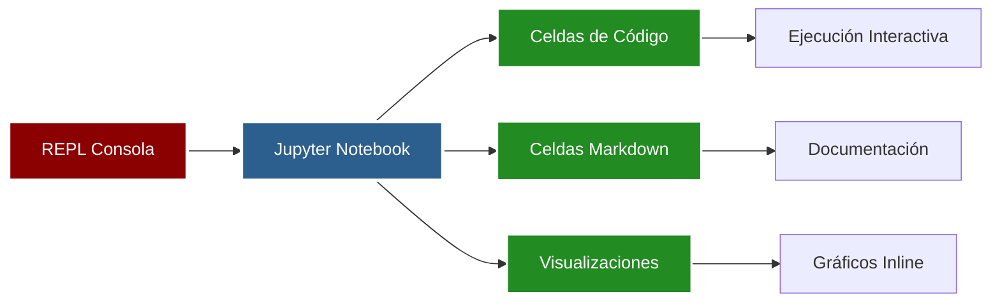
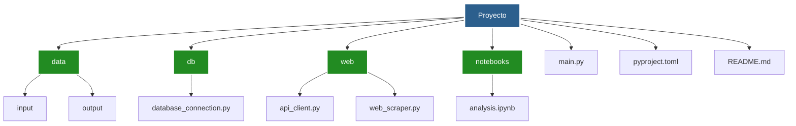

# BOOTCAMP 4.0

- Jueves:
  - [Cambio de REPL a Jupyter Notebook](#cambio-de-repl-a-jupyter-notebook)
  - [Manipulación básica de datos con Jupyter Notebook](#manipulación-básica-de-datos-con-jupyter-notebook)
  - [Uso de requests](#uso-de-requests)
  - [Creación y estructura de proyectos](#creación-y-estructura-de-proyectos)

---

## Cambio de REPL a Jupyter Notebook

### 🎯 ¿Qué es Jupyter Notebook?

Jupyter Notebook es un entorno interactivo que permite combinar código,
visualizaciones y texto explicativo en un solo documento. Es ideal para
análisis de datos, experimentación y documentación de código.

<div style="background-color: black; border-radius: 10px; padding: 20px; margin: 20px 0;">



</div>

### 💡 Ventajas de Jupyter Notebook

- **Interactividad**: Ejecuta código por celdas
- **Visualización**: Muestra gráficos directamente en el notebook
- **Documentación**: Combina código y explicaciones
- **Reproducibilidad**: Guarda resultados y código juntos

### 🚀 Instalación

```bash
pip install jupyter notebook
```

Para iniciar un notebook:

```bash
jupyter notebook
```

## Manipulación básica de datos con Jupyter Notebook

### 📊 Tipos de celdas

En Jupyter Notebook puedes usar diferentes tipos de celdas:

- **Celdas de código Python**: Ejecutan código Python
- **Celdas Markdown**: Documentan y explican el código
- **Celdas Raw**: Texto sin formato

### 💻 Ejemplo básico con pandas y matplotlib

```python
import pandas as pd
import matplotlib.pyplot as plt

# Cargar datos
df = pd.read_csv('data.csv')

# Visualizar primeros registros
df.head()

# Crear gráfico
plt.figure(figsize=(10, 6))
plt.plot(df['fecha'], df['total'])
plt.title('Ventas por fecha')
plt.show()
```

### 📝 Ejemplo de celda Markdown

```markdown
## Análisis de Datos

Este notebook analiza las ventas del último trimestre.

### Resultados principales:

- Total de ventas: $150,000
- Producto más vendido: Mouse
```

## Uso de requests

### 🌐 Introducción a requests

La librería `requests` permite hacer peticiones HTTP desde Python de forma
simple y elegante.

### 📦 Instalación

```bash
pip install requests
```

### 💡 Obtener datos de APIs (JSON)

```python
import requests

# Hacer petición GET
response = requests.get('https://api.example.com/data')

# Obtener JSON
data = response.json()
print(data)
```

### 🌐 Obtener datos de páginas web (HTML)

```python
import requests
from bs4 import BeautifulSoup

# Obtener HTML
response = requests.get('https://example.com')
html = response.text

# Parsear con BeautifulSoup
soup = BeautifulSoup(html, 'html.parser')
title = soup.find('title')
print(title.text)
```

## Creación y estructura de proyectos

### 🔧 Inicializar proyecto con uv

`uv` es un gestor de paquetes rápido para Python. Para inicializar un proyecto:

```bash
uv init tiny_project
cd tiny_project
```

### 📦 Agregar dependencias

```bash
uv add numpy pandas matplotlib sqlalchemy psycopg requests beautifulsoup4
```

### 📁 Estructura recomendada de proyectos

<div style="background-color: black; border-radius: 10px; padding: 20px; margin: 20px 0;">



</div>

### 💡 Organización de carpetas

- **data/**: Datos de entrada y salida
- **db/**: Conexiones y utilidades de base de datos
- **web/**: Clientes API y web scrapers
- **notebooks/**: Análisis y experimentación
- **main.py**: Punto de entrada principal

### ✅ Buenas prácticas

- Separar código por funcionalidad
- Mantener datos separados del código
- Usar notebooks para análisis exploratorio
- Documentar con README.md

<style>
 .background-images {
 pointer-events: none;
 }
 .background-images* {
 pointer-events: auto;
 }
</style>

<div
 class="background-images"
 style="
 position: fixed;
 top:0;
 display: flex;
 justify-content: center;
 align-items: center;
 height: 100vh;
 opacity: 0.1;
 z-index: 0;
 "
>
 
 
</div>
