# BOOTCAMP 4.0

- Martes:
  - [Visión General de lenguajes](#visión-general-de-lenguajes-de-programación):
    tipos, dominio, implementación, paradigmas soportados.
  - [Introducción e instalación a Python.](#introducción-e-instalación-a-python)
  - [Formas de ejecutar código Python.](#formas-de-ejecutar-código-python)
  - [Sintaxis y estructura básica.](#sintaxis-y-estructura-básica)

---

## Visión General de Lenguajes de Programación

### Tipos de Lenguajes

Los lenguajes de programación se pueden clasificar según varios criterios:

**Por nivel de abstracción:**

<div style="background-color: black; border-radius: 10px; padding: 20px; margin: 20px 0;">

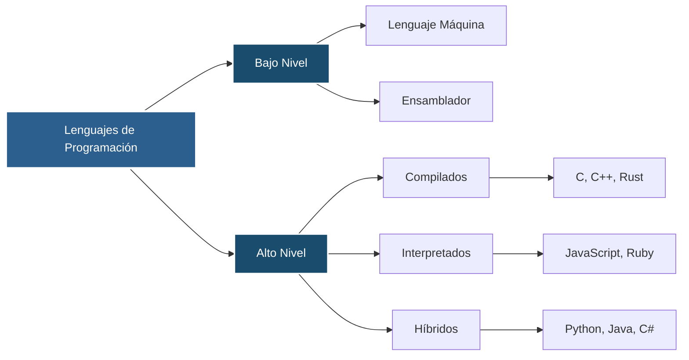

</div>

**Por tipado:**

<div style="background-color: black; border-radius: 10px; padding: 20px; margin: 20px 0;">

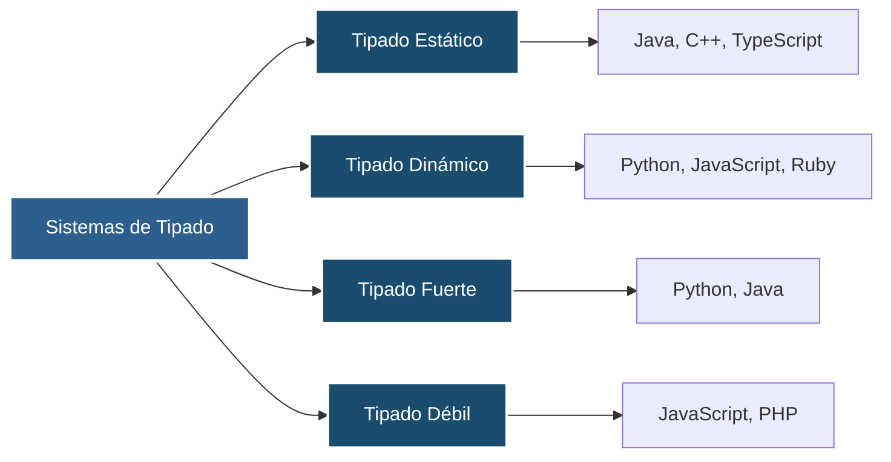

</div>

### Dominios de Aplicación

Los lenguajes de programación se especializan en diferentes dominios:

<div style="background-color: black; border-radius: 10px; padding: 20px; margin: 20px 0;">

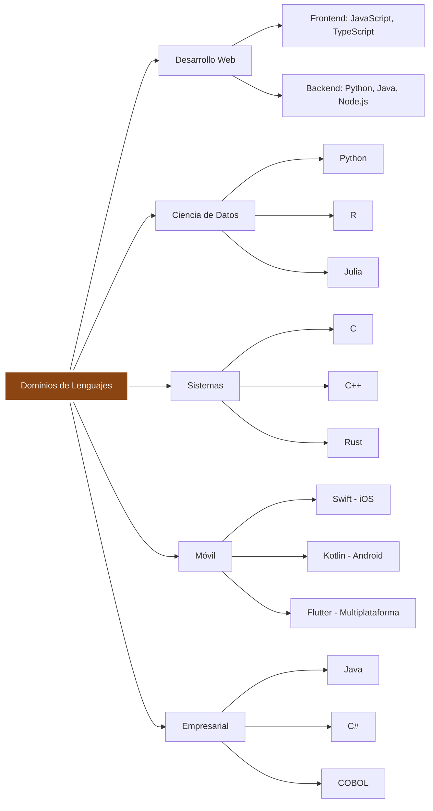

</div>

### Paradigmas de Programación

<div style="background-color: black; border-radius: 10px; padding: 20px; margin: 20px 0;">

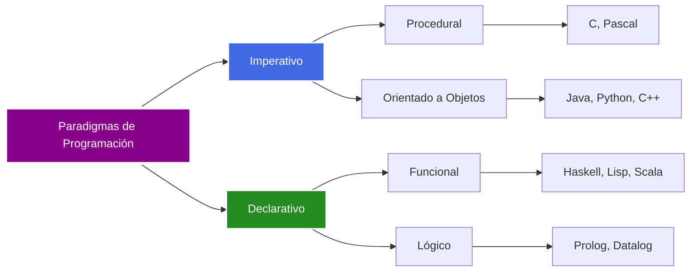

</div>

**Características de cada paradigma:**

- **Imperativo**: Define cómo se ejecuta el programa paso a paso
- **Declarativo**: Define qué se quiere lograr, no cómo
- **Orientado a Objetos**: Organiza código en objetos con datos y comportamiento
- **Funcional**: Trata la computación como evaluación de funciones matemáticas

---

## Introducción e Instalación a Python

### ¿Qué es Python?

Python es un lenguaje de programación de alto nivel, interpretado, de propósito
general y con tipado dinámico. Creado por Guido van Rossum en 1991.

<div style="background-color: black; border-radius: 10px; padding: 20px; margin: 20px 0;">

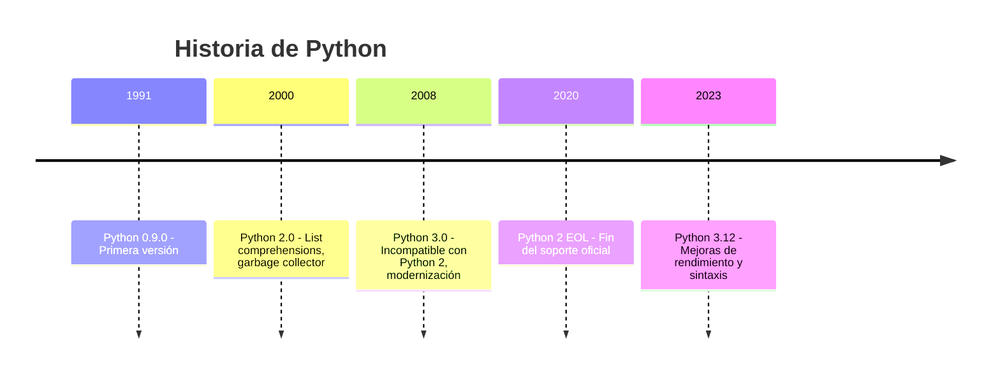

</div>

### Características Principales

<div style="background-color: black; border-radius: 10px; padding: 20px; margin: 20px 0;">

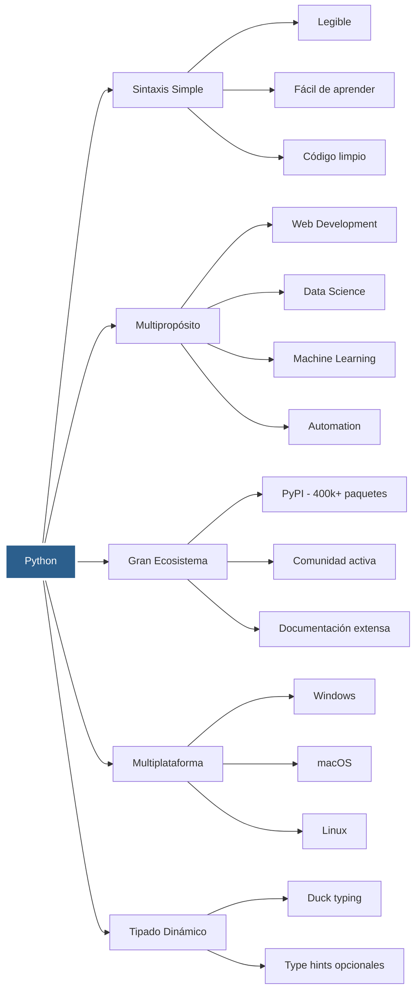

</div>

### Proceso de Instalación

<div style="background-color: black; border-radius: 10px; padding: 20px; margin: 20px 0;">

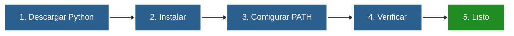

</div>

**Pasos detallados por sistema operativo:**

- **Windows**: Descargar desde python.org → Ejecutar instalador → Marcar "Add to PATH"
- **macOS**: `brew install python3` o descargar desde python.org
- **Linux**: `sudo apt install python3` o `sudo yum install python3`

**Verificación:**

```bash
python --version
pip --version
```

### Gestión de Entornos Virtuales

<div style="background-color: black; border-radius: 10px; padding: 20px; margin: 20px 0;">

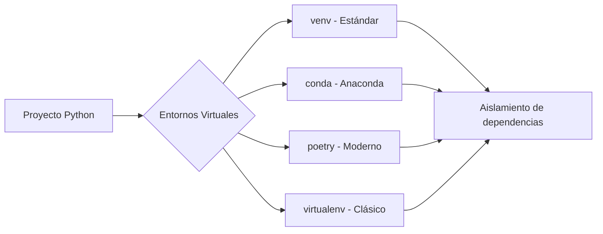

</div>

---

## Formas de Ejecutar Código Python

### Modalidades de Ejecución

<div style="background-color: black; border-radius: 10px; padding: 20px; margin: 20px 0;">

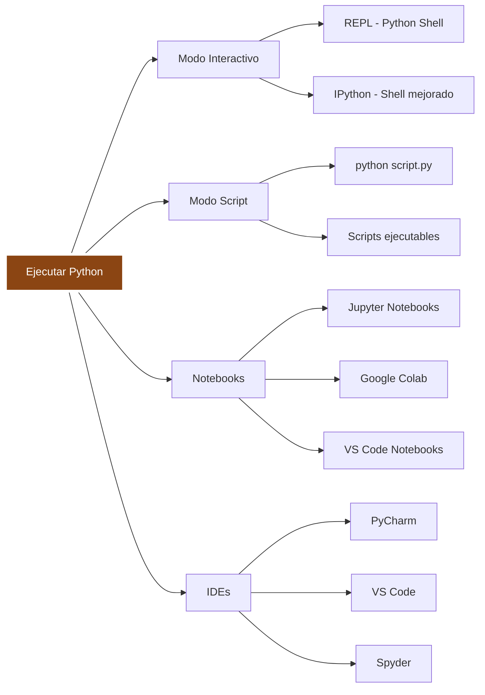

</div>

### Comparación de Métodos

<div style="background-color: black; border-radius: 10px; padding: 20px; margin: 20px 0;">

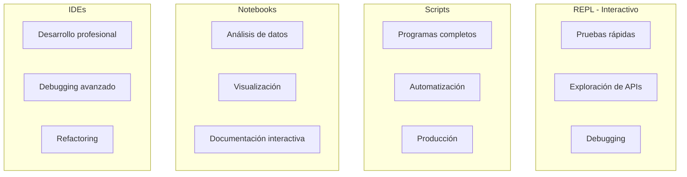

</div>

### Flujo de Ejecución

<div style="background-color: black; border-radius: 10px; padding: 20px; margin: 20px 0;">

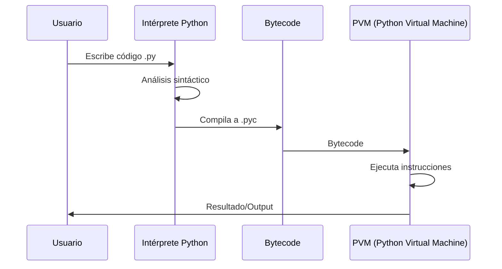

</div>

### Comandos Básicos

**REPL/Shell:**

```bash
# Start Python shell
python
>>> print("Hello World")
>>> exit()

# IPython (more features)
ipython
```

**Ejecutar Scripts:**

```bash
# Basic execution
python my_script.py

# With arguments
python my_script.py arg1 arg2

# Executable script (Unix/Linux)
chmod +x my_script.py
./my_script.py
```

**Jupyter:**

```bash
# Install
pip install jupyter

# Start server
jupyter notebook

# Or JupyterLab
jupyter lab
```

---

## Sintaxis y Estructura Básica

### Elementos Fundamentales

<div style="background-color: black; border-radius: 10px; padding: 20px; margin: 20px 0;">

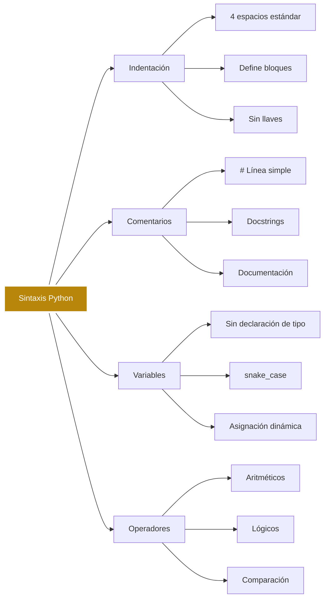

</div>

**Ejemplo práctico con indentación, comentarios y operadores:**

```python
# file: fundamentals.py

# Single-line comment
message = "Hello Bootcamp"  # snake_case variable

def greet(name: str) -> str:
    """Docstring that describes the function."""
    result = f"{message}, {name}"
    if len(name) > 5:
        result += " (long name)"
    return result.upper()

print(greet("Team"))
print(3 + 5 * 2)  # Arithmetic operators
```

```bash
# Run the file and check the output
python fundamentals.py
```

### Estructura de un Programa Python

<div style="background-color: black; border-radius: 10px; padding: 20px; margin: 20px 0;">

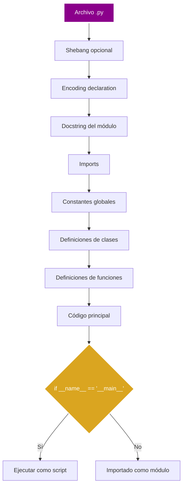

</div>

**Plantilla mínima de script y ejecución:**

```python
# file: base_structure.py
#!/usr/bin/env python3
# -*- coding: utf-8 -*-
"""Basic structure example."""

import pathlib

VERSION = "1.0.0"

def main() -> None:
    current_path = pathlib.Path(__file__).parent
    print(f"Version: {VERSION}")
    print(f"Running from: {current_path}")

if __name__ == "__main__":
    main()
```

```bash
chmod +x base_structure.py   # Optional on Unix
./base_structure.py          # or python base_structure.py
```

### Tipos de Datos Básicos

<div style="background-color: black; border-radius: 10px; padding: 20px; margin: 20px 0;">

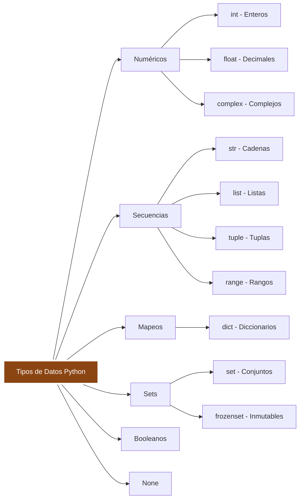

</div>

**Inspección rápida de tipos en REPL e impresión formateada:**

```python
# file: types_demo.py
collection = {
    "number": 42,
    "pi": 3.1415,
    "text": "Hello",
    "list": [1, 2, 3],
    "set": {"python", "bootcamp"},
    "dictionary": {"course": "DevLights", "level": "Beginner"},
}

for name, value in collection.items():
    print(f"{name:<12} -> {type(value).__name__} = {value}")
```

```bash
python -i types_demo.py  # Keep interactive mode to continue testing
```

### Estructuras de Control

<div style="background-color: black; border-radius: 10px; padding: 20px; margin: 20px 0;">

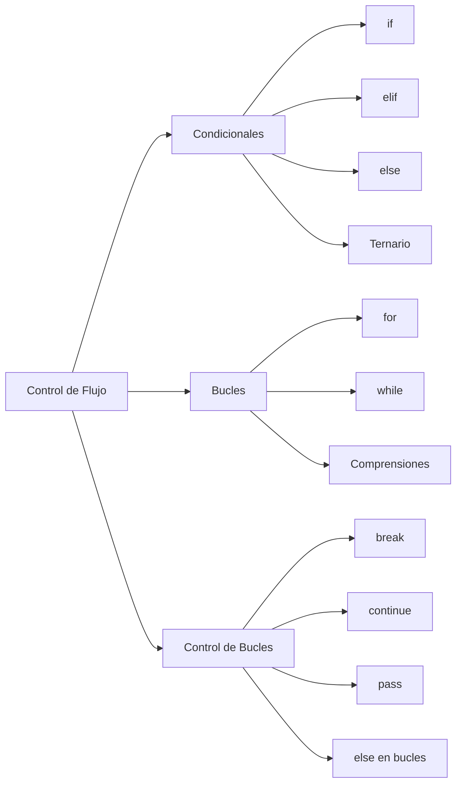

</div>

**Control de flujo en acción:**

```python
# file: control_flow.py
from random import randint

def evaluate_number():
    number = randint(1, 10)
    message = "Even number" if number % 2 == 0 else "Odd number"
    print(f"Generated number: {number} -> {message}")

for _ in range(3):
    evaluate_number()
else:
    print("Loop finished without break.")
```

```bash
python control_flow.py
```

### Ejemplo de Sintaxis Completa

```python
#!/usr/bin/env python3
# -*- coding: utf-8 -*-
"""Example module showing basic Python syntax."""

# Imports
from typing import List

# Global constant
PI = 3.14159

class Calculator:
    """Example class with basic operations."""

    def __init__(self, name: str):
        self.name = name
        self.history: List[float] = []

    def add(self, a: float, b: float) -> float:
        """Add two numbers."""
        result = a + b
        self.history.append(result)
        return result

    def circle_area(self, radius: float) -> float:
        """Calculate the area of a circle."""
        return PI * radius ** 2

def main():
    """Main function."""
    # Create instance
    calc = Calculator("MyCalc")

    # Operations
    sum_result = calc.add(5, 3)
    area = calc.circle_area(10)

    # Conditional
    if sum_result > 5:
        print(f"The sum {sum_result} is greater than 5")

    # For loop
    for i in range(3):
        print(f"Iteration {i}")

    # List comprehension
    squares = [x**2 for x in range(5)]
    print(squares)

if __name__ == "__main__":
    main()
```

```bash
python syntax_example.py
```

### Convenciones de Estilo (PEP 8)

<div style="background-color: black; border-radius: 10px; padding: 20px; margin: 20px 0;">

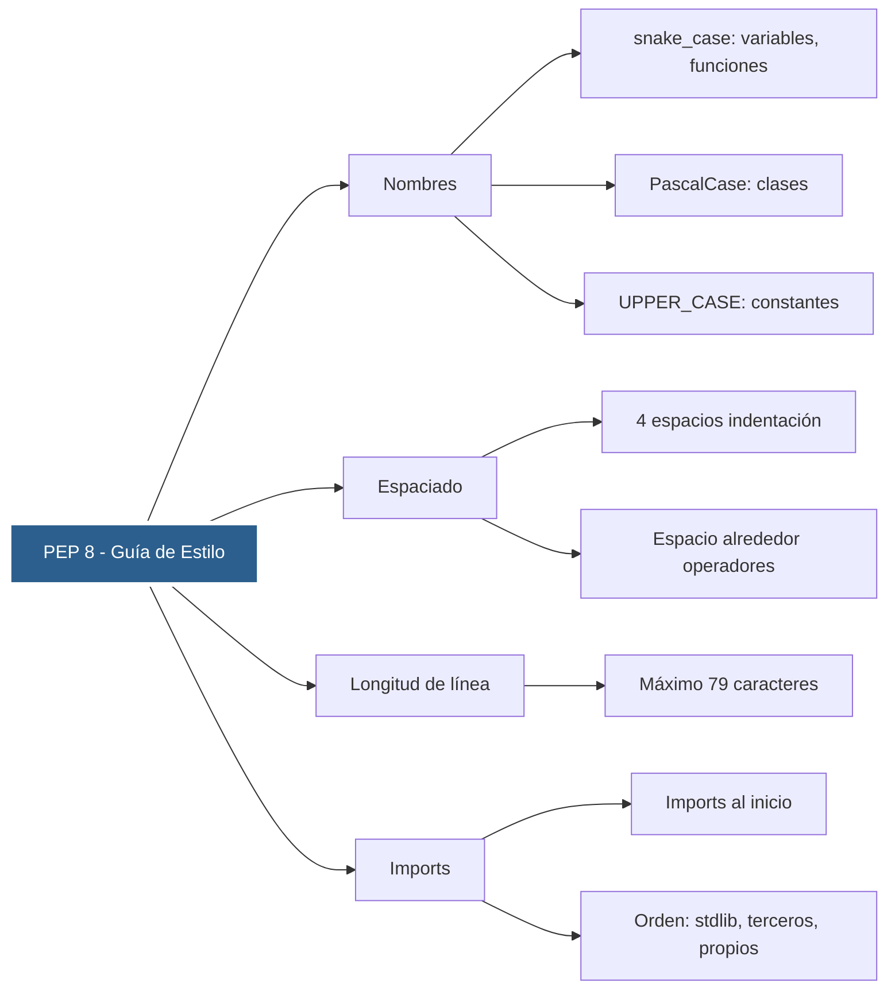

</div>

**Comparación rápido ✅/❌ y chequeo con linters:**

```python
# Correct example
def calculate_total(unit_price: float, quantity: int) -> float:
    return unit_price * quantity

# Incorrect example (confusing names, no spaces)
def ct(p,c):
    return p*c
```

```bash
pip install ruff --quiet
ruff check base_structure.py control_flow.py syntax_example.py
```

---

<style>
  .background-images {
    pointer-events: none;
  }
  .background-images* {
    pointer-events: auto;
  }
</style>

<div
  class="background-images"
  style="
    position: fixed;
    top:0;
    display: flex;
    justify-content: center;
    align-items: center;
    height: 100vh;
    opacity: 0.1;
    z-index: 0;
  "
>


</div>
